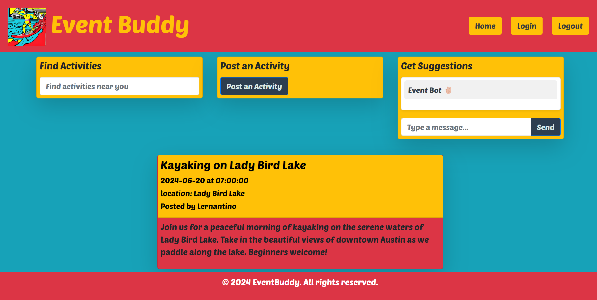

# EventBuddy

EventBuddy is a website that lets you find, post, and get suggestions for activities near you with like-minded individuals and to find new friends. Whether you're looking for a hiking buddy, a new book club, or a local meetup, EventBuddy helps you connect with others who share your interests.

## Description

EventBuddy aims to make socializing easier by providing a platform where users can:
- **Find activities:** Discover events and activities happening near you.
- **Post activities:** Create and share your own events to invite others.
- **Get suggestions:** Receive personalized activity suggestions based on your interests.
- **Meet new people:** Connect with new friends who have similar hobbies and interests.

## Features

- User registration and login
- Profile creation
- Activity search and filtering
- Activity posting and management
- Personalized activity suggestions

## Screenshot

## Link to Deployed Application

Check out the live application here: https://event-buddy.onrender.com/
